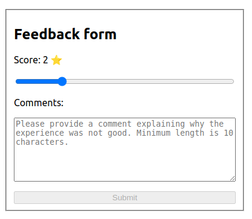
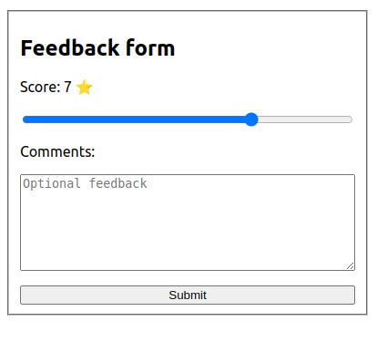

# Feedback Form
This project contains a feedback form component built with React. Users can provide a score between 0 and 10, along with an optional comment, and submit the form. The form submission can be disabled under certain conditions.

#Installation
Clone the repository:

git clone https://github.com/onurtufekci34/feedback-form.git

# Navigate to the project directory:

cd feedback-form

#Install the dependencies:

npm install

# Start the development server:

npm start

#Open your browser and visit http://localhost:3000 to view the app.

Modify the App.js and FeedbackForm.js files to customize the form and its behavior according to your requirements.

# Components
App
The App component serves as the entry point for the feedback form. It renders the FeedbackForm component and handles form submission.

# FeedbackForm
The FeedbackForm component displays a feedback form with the following features:

Score input: Users can select a score between 0 and 10 using a range input.
Comment input: Users can provide an optional comment explaining their feedback.
Submission button: Users can submit the form.
Submission validation: The submission button is disabled if the score is lower than 5 and no feedback is provided.

# Testing
The project includes tests for the FeedbackForm component using Jest and React Testing Library. To run the tests, use the following command:

npm test

# For test

# Contributing
Contributions are welcome! If you find any issues or have suggestions for improvements, please open an issue or submit a pull request.

# License
This project is licensed under the MIT License.

